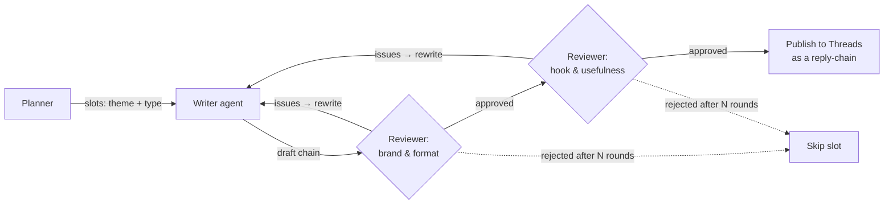

# ThreadForge

**Multi-agent AI content engine for Threads — plan → write → review → publish.**

ThreadForge is a small, production-style framework where specialised AI agents
collaborate to produce social content and publish it to [Threads](https://www.threads.net)
through the official API. Instead of one prompt doing everything, a **writer**
drafts, and independent **reviewers** — each optimising for a different thing
(brand & format, hook & usefulness) — argue with the draft until it's genuinely
good. Anything that can't pass every gate is skipped, not shipped.

This repo is the **reference architecture / skeleton**: the engine, the pipeline
and clean example prompts. Drop in your own voice, rules and niche.

---

## How it works



- **Every agent is a prompt.** A role = a system prompt + one LLM call
  (`callRole` in [`src/agents/llm.ts`](src/agents/llm.ts)). Swap models per role
  to balance cost vs quality.
- **The review gate is the point.** Two reviewers with *different jobs* both have
  to approve. Add a third (safety/toxicity) by adding one prompt file and one
  line — see [`src/pipeline.ts`](src/pipeline.ts).
- **Publishes real chains.** A Threads "chain" is a hook post plus replies;
  [`src/publish/threads.ts`](src/publish/threads.ts) posts them in order via the
  official Graph API and tags the topic.
- **Idempotent by stream.** A tiny JSON dedup store keeps each content stream
  from repeating itself ([`src/utils/dedup-store.ts`](src/utils/dedup-store.ts)).

## Project layout

```
prompts/                # each agent's behaviour — plain markdown, easy to tune
  writer.md
  reviewer.md           # gate 1: brand & format
  reviewer-virality.md  # gate 2: hook & usefulness
  planner.md
src/
  agents/llm.ts         # the core primitive: callRole + extractJson
  agents/writer.ts
  agents/reviewer.ts    # one loader, many gates
  pipeline.ts           # the write ↔ review loop
  publish/threads.ts    # official Threads API chain publisher
  utils/                # dedup store, logger
examples/run.ts         # run one slot end-to-end
```

## Quick start

```bash
npm install
cp .env.example .env      # add OPENAI_API_KEY
npm run demo              # generates a chain through the full review pipeline
```

To publish, add `THREADS_ACCESS_TOKEN` and `THREADS_USER_ID` (from Meta OAuth) and
uncomment the publish call in `examples/run.ts`.

## Tech

TypeScript · Node 20+ · OpenAI (or any compatible LLM) · Meta Threads Graph API.

## Design notes

- **Prompts are the config.** No behaviour is hard-coded — retune voice and rules
  by editing markdown, not code.
- **Cheap model for reviews, strong model for the flagship writer** keeps cost
  down without dropping quality where it matters.
- **Skip beats ship.** A slot that fails review is dropped with its notes, so the
  feed never fills with weak posts.

---

Built by a developer who ships AI agents for real businesses. This is the public
skeleton — the tuned prompts, funnel logic and data that run in production stay
private, but the architecture is all here.

*MIT licensed. Not affiliated with Meta.*
